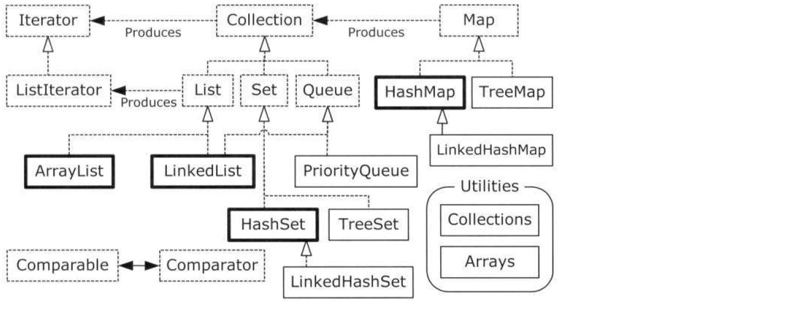

*[English](README.md) ∙ [Русский](README-ru.md)*

## Common topics

### Programming paradigms

* **imperative** in which the programmer instructs the machine how to change its state
    * *structured and procedural* - most often we should be able to use the term interchangeably but with subtle
      differences. When higher level languages begun to get richer, one realized that all units of work should be broken
      into smaller tractable parts - that is when functions came into existence and programming became a hierarchy of
      functions and many at lower level could be re-used.
    * *object-oriented* which groups instructions with the part of the state they operate on.
* **declarative** in which the programmer merely declares properties of the desired result, but not how to compute it
    * *functional* in which the desired result is declared as the value of a series of function applications.
    * *logic* in which the desired result is declared as the answer to a question about a system of facts and rules.
    * *reactive* in which the desired result is declared with data streams and the propagation of change

#### Object-oriented programming (OOP)

Alan Kay summarized five basic characteristics of Smalltalk, the first successful object-oriented language and one of
the languages upon which Java is based. These characteristics represent a pure approach to object-oriented programming:

1. Everything is an object. Think of an object as a fancy variable; it stores data, but you can “make requests” to that
   object, asking it to perform operations on itself. In theory, you can take any conceptual component in the problem
   you’re trying to solve (dogs, buildings, services, etc.) and represent it as an object in your program.
2. A program is a bunch of objects telling each other what to do by sending messages. To make a request of an object,
   you “send a message” to that object. More concretely, you can think of a message as a request to call a method that
   belongs to a particular object.
3. Each object has its own memory made up of other objects. Put another way, you create a new kind of object by making a
   package containing existing objects. Thus, you can build complexity into a program while hiding it behind the
   simplicity of objects.
4. Every object has a type. Using the parlance, each object is an instance of a class, in which “class” is synonymous
   with “type.” The most important distinguishing characteristic of a class is “What messages can you send to it?”
5. All objects of a particular type can receive the same messages. This is actually a loaded statement, as you will see
   later. Because an object of type “circle” is also an object of type “shape,” a circle is guaranteed to accept shape
   messages. This means you can write code that talks to shapes and automatically handle anything that fits the
   description of a shape. This substitutability is one of the powerful concepts in OOP.

Basic principles of structuring:
* *Abstraction* from implementation
* *Encapsulation* prevents external code from being concerned with the internal workings of an object. This facilitates
  code refactoring, for example allowing the author of the class to change how objects of that class represent their
  data internally without changing any external code (as long as "public" method calls work the same way). It also
  encourages programmers to put all the code that is concerned with a certain set of data in the same class, which
  organizes it for easy comprehension by other programmers. Encapsulation is a technique that encourages decoupling.
* *Inheritance* allows classes to be arranged in a hierarchy that represents "is-a-type-of" relationships. All the data
  and methods available to the parent class also appear in the child class with the same names. This technique allows
  easy re-use of the same procedures and data definitions, in addition to potentially mirroring real-world relationships
  in an intuitive way. Rather than utilizing database tables and programming subroutines, the developer utilizes objects
  the user may be more familiar with: objects from their application domain.
* *Polymorphism* – is when calling code can be independent of which class in the supported hierarchy it is operating on
  – the parent class or one of its descendants. Meanwhile, the same operation name among objects in an inheritance
  hierarchy may behave differently.

#### Aspect-oriented programming (AOP)

AOP is often referred to as a tool for implementing crosscutting concerns. The term crosscutting concerns refers to
logic in an application that cannot be decomposed from the rest of the application and may result in code duplication
and tight coupling. By using AOP for modularizing individual pieces of logic, known as concerns, you can apply them to
many parts of an application without duplicating the code or creating hard dependencies. Logging and security are
typical examples of crosscutting concerns that are present in many applications. Consider an application that logs the
start and end of every method for debugging purposes. You will probably refactor the logging code into a special class,
but you still have to call methods on that class twice per method in your application in order to perform the logging.
Using AOP, you can simply specify that you want the methods on your logging class to be invoked before and after each
method call in your application. It is important to understand that AOP complements object-oriented programming (OOP),
rather than competing with it. OOP is very good at solving a wide variety of problems that we, as programmers,
encounter. However, if you look at the logging example again, it is obvious to see where OOP is lacking when it comes to
implementing crosscutting logic on a large scale. Using AOP on its own to develop an entire application is practically
impossible, given that AOP functions on top of OOP. Likewise, although it is certainly possible to develop entire
applications by using OOP, you can work smarter by employing AOP to solve certain problems that involve crosscutting
logic. This chapter covers the following topics:

* AOP Concepts As with most technologies, AOP comes with its own specific set of concepts and terms. The following are
  the core concepts of AOP:
    * *Joinpoints*: A joinpoint is a well-defined point during the execution of your application. Typical examples of
      joinpoints include a call to a method, the method invocation itself, class initialization, and object
      instantiation. Joinpoints are a core concept of AOP and define the points in your application at which you can
      insert additional logic using AOP.
    * *Advice*: The code that is executed at a particular joinpoint is the advice, defined by a method in your class.
      There are many types of advice, such as before, which executes before the joinpoint, and after, which executes
      after it.
    * *Pointcuts*: A pointcut is a collection of joinpoints that you use to define when advice should be executed. By
      creating pointcuts, you gain fine-grained control over how you apply advice to the components in your application.
      As mentioned previously, a typical joinpoint is a method invocation, or the collection of all method invocations
      in a particular class. Often you can compose pointcuts in complex relationships to further constrain when advice
      is executed.
    * *Aspects*: An aspect is the combination of advice and pointcuts encapsulated in a class. This combination results
      in a definition of the logic that should be included in the application and where it should execute.
    * *Weaving*: This is the process of inserting aspects into the application code at the appropriate point. For
      compile-time AOP solutions, this weaving is generally done at build time. Likewise, for runtime AOP solutions, the
      weaving process is executed dynamically at runtime. AspectJ supports another weaving mechanism called load- time
      weaving (LTW), in which it intercepts the underlying JVM class loader and provides weaving to the bytecode when it
      is being loaded by the class loader.
    * *Target*: An object whose execution flow is modified by an AOP process is referred to as the target object. Often
      you see the target object referred to as the advised object.
    * *Introduction*: This is the process by which you can modify the structure of an object by introducing additional
      methods or fields to it. You can use introduction AOP to make any object implement a specific interface without
      needing the object’s class to implement that interface explicitly.

### Data structures

* List
* Black-white tree
* BI-tree

### O-notation

### Algorithm complexity

### SOLID, DRY

### Programming patterns

### JSON, Protocol Buffers (Protobuf)

### Protocols

- STOMP
- HTTP
- TCP
-

### REST, RPC

### Math

## Java

### Data types 🐣

| Primitive type |  Size   |  Minimum  |     Maximum     |     Default     | Wrapper type |
|----------------|--------:|----------:|----------------:|----------------:|--------------|
| boolean        |  -      |     -     |        -        |           false | Boolean      |
| byte           | 8 bits  |      -128 |            +127 |         (byte)0 | Byte         |
| short          | 16 bits |     -2^15 |         +2^15-1 |        (short)0 | Short        |
| char           | 16 bits | Unicode 0 | Unicode 2^16- 1 | ‘\u0000’ (null) | Character    |
| int            | 32 bits |     -2^31 |         +2^31-1 |               0 | Integer      |
| long           | 64 bits |     -2^63 |         +2^63-1 |              0L | Long         |
| float          | 32 bits |   IEEE754 |         IEEE754 |            0.0f | Float        |
| double         | 64 bits |   IEEE754 |         IEEE754 |            0.0d | Double       |
| void           |    -    |     -     |        -        |        -        | Void         |

### Annotations

Meta Annotations:

* `@Retention` - Specifies how the marked annotation is stored, whether in code only, compiled into the class, or
  available at runtime through reflection.
* `@Documented` - Marks another annotation for inclusion in the documentation.
* `@Target` - Marks another annotation to restrict what kind of Java elements the annotation may be applied to.
* `@Inherited` - Marks another annotation to be inherited to subclasses of annotated class (by default annotations are
  not inherited by subclasses).
* `@Repeatable` - Specifies that the annotation can be applied more than once to the same declaration, since Java 8.

Built-in annotations:

* `@Override` - Checks that the method is an override. Causes a compilation error if the method is not found in one of
  the parent classes or implemented interfaces.
* `@Deprecated` - Marks the method as obsolete. Causes a compile warning if the method is used.
* `@SuppressWarnings` - Instructs the compiler to suppress the compile time warnings specified in the annotation
  parameters.
* `@SafeVarargs` - Suppress warnings for all callers of a method or constructor with a generics varargs parameter, since
  Java 7.
* `@FunctionalInterface` - Specifies that the type declaration is intended to be a functional interface, since Java 8.

### Collections

Table: Simple Container Taxonomy

HashMap

TreeMap

### Lambda and Streams

### Java memory model (JMM)

### Concurrency

Synchronization is required for reliable communication between threads as well as for mutual exclusion.

#### Package java.util.concurrent

### JMS

### JMX

### Exceptions

### Transactions

### Garbage collectors (GC)

### ORM: Hibernate, MyBatis and so on

### Spring

#### Spring core (DI)

#### Spring AOP

Besides dependency injection (DI), another core feature that the Spring Framework offers is support for aspect-oriented
programming (AOP).

* *Types of AOP*:
  There are two distinct types of AOP: static and dynamic. In static AOP, like that provided by AspectJ’s1 compile-time
  weaving mechanisms, the crosscutting logic is applied to your code at compile time, and you cannot change it without
  modifying the code and recompiling. With dynamic AOP, such as Spring AOP, crosscutting logic is applied dynamically at
  runtime. This allows you to make changes to the AOP configuration without having to recompile the application. These
  types of AOP are complementary, and, when used together, they form a powerful combination that you can use in your
  applications.
* *Spring AOP architecture*: Spring AOP is only a subset of the full AOP feature set found in other implementations such
  as AspectJ. In this chapter, we take a high-level look at which features are present in Spring, how they are
  implemented, and why some features are excluded from the Spring implementation.
* *Proxies in Spring AOP*: Proxies are a huge part of how Spring AOP works, and you must understand them to get the most
  out of Spring AOP. In this chapter, we look at the two kinds of proxy: the JDK dynamic proxy and the CGLIB proxy. In
  particular, we look at the different scenarios in which Spring uses each proxy, the performance of the two proxy
  types, and some simple guidelines to follow in your application to get the most from Spring AOP.
* *Using Spring AOP*: In this chapter, we present some practical examples of AOP usage. We start off with a simple Hello
  World example to ease you into Spring’s AOP code, and we continue with a detailed description of the AOP features that
  are available in Spring, complete with examples.
* *Advanced use of pointcuts*: We explore the ComposablePointcut and ControlFlowPointcut classes, introductions, and
  appropriate techniques you should employ when using pointcuts in your application.
* *AOP framework services*: The Spring Framework fully supports configuring AOP transparently and declaratively. We look
  at three ways (the ProxyFactoryBean class, the aop namespace, and @AspectJ-style annotations) to inject declaratively
  defined AOP proxies into your application objects as collaborators, thus making your application completely unaware
  that it is working with advised objects.
* *Integrating AspectJ*: AspectJ is a fully featured AOP implementation. The main difference between AspectJ and Spring
  AOP is that AspectJ applies advice to target objects via weaving (either compile-time or load-time weaving), while
  Spring AOP is based on proxies. The feature set of AspectJ is much greater than that of Spring AOP, but it is much
  more complicated to use than Spring. AspectJ is a good solution when you find that Spring AOP lacks a feature you
  need.

##### Types of AOP

There are two distinct types of AOP: static and dynamic.

* Using Static AOP. In static AOP, the weaving process forms another step in the build process for an application. In
  Java terms, you achieve the weaving process in a static AOP implementation by modifying the actual bytecode of your
  application, changing and extending the application code as necessary. This is a well-performing way of achieving the
  weaving process because the end result is just Java bytecode, and you do not perform any special tricks at runtime to
  determine when advice should be executed. The drawback of this mechanism is that any modifications you make to the
  aspects, even if you simply want to add another joinpoint, require you to recompile the entire application. AspectJ’s
  compile-time weaving is an excellent example of a static AOP implementation.
* Using Dynamic AOP. Dynamic AOP implementations, such as Spring AOP, differ from static AOP implementations in that the
  weaving process is performed dynamically at runtime. How this is achieved is implementation-dependent, but as you will
  see, Spring’s approach is to create proxies for all advised objects, allowing for advice to be invoked as required.
  The drawback of dynamic AOP is that, typically, it does not perform as well as static AOP, but the performance is
  steadily increasing. The major benefit of dynamic AOP implementations is the ease with which you can modify the entire
  aspect set of an application without needing to recompile the main application code.
* Choosing an AOP Type. Choosing whether to use static or dynamic AOP is quite a hard decision. Both have their own
  benefits, and you are not restricted to using only one type. In general, static AOP implementations have been around
  longer and tend to have more feature-rich implementations, with a greater number of available joinpoints. Typically,
  if performance is absolutely critical or you need an AOP feature that is not implemented in Spring, you will want to
  use AspectJ. In most other cases, Spring AOP is ideal. Keep in mind that many AOP-based solutions such as transaction
  management are already provided for you by Spring, so check the framework capabilities before rolling your own! As
  always, let the requirements of your application drive your choice of AOP implementation, and don’t restrict yourself
  to a single implementation if a combination of technologies would better suit your application. In general, Spring AOP
  is less complex than AspectJ, so it tends to be an ideal first choice.

Table 1. Advice Types in Spring.

| Advice Name   | Interface and description |
| ------------- | ------------------------- |
| Before  | `org.springframework.aop.MethodBeforeAdvice` Using before advice, you can perform custom processing before a joinpoint executes. Because a joinpoint in Spring is always a method invocation, this essentially allows you to perform preprocessing before the method executes. Before advice has full access to the target of the method invocation as well as the arguments passed to the method, but it has no control over the execution of the method itself. If the before advice throws an exception, further execution of the interceptor chain (as well as the target method) will be aborted, and the exception will propagate back up the interceptor chain.|
| After-Returning  | `org.springframework.aop.AfterReturningAdvice` After-returning advice is executed after the method invocation at the joinpoint has finished executing and has returned a value. The after- returning advice has access to the target of the method invocation, the arguments passed to the method, and the return value. Because the method has already executed when the after-returning advice is invoked, it has no control over the method invocation at all. If the target method throws an exception, the after- returning advice will not be run, and the exception will be propagated up to the call stack as usual. |
| After(finally)  | `org.springframework.aop.AfterAdvice` After-returning advice is executed only when the advised method completes normally. However, the after (finally) advice will be executed no matter the result of the advised method. The advice is executed even when the advised method fails and an exception is thrown. |
| Around  | `org.aopalliance.intercept.MethodInterceptor` In Spring, around advice is modeled using the AOP Alliance standard of a method interceptor. Your advice is allowed to execute before and after the method invocation, and you can control the point at which the method invocation is allowed to proceed. You can choose to bypass the method altogether if you want, providing your own implementation of the logic. |
| Throws | `org.springframework.aop.ThrowsAdvice` Throws advice is executed after a method invocation returns, but only if that invocation threw an exception. It is possible for throws advice to catch only specific exceptions, and if you choose to do so, you can access the method that threw the exception, the arguments passed into the invocation, and the target of the invocation. |
| Introduction  | `org.springframework.aop.IntroductionInterceptor` Spring models introductions as special types of interceptors. Using an introduction interceptor, you can specify the implementation for methods that are being introduced by the advice. |

#### Spring JDBC

#### Spring WebFlux

### Maven and Gradle

### Bootstrap ClassLoader ⭐

## Surrounding technologies

### GIT

### Kubernetes

### RDBMS and SQL

### NoSQL

### Flyway vs Liquibase

### Message brokers

* Kafka
* RabbitMQ

### Practice

* https://leetcode.com
* https://www.hackerrank.com

## Architecture

## FAQ

## References

1. Pro Spring 5. An In-Depth Guide to the Spring Framework and Its Tools. Fifth Edition.
   *Iuliana Cosmina, Rob Harrop, Chris Schaefer, Clarence Ho.*
2. Effective Java. Third Edition. *Joshua Bloch.*
3. Thinking in Java, Fourth Edition. *Bruce Eckel.*